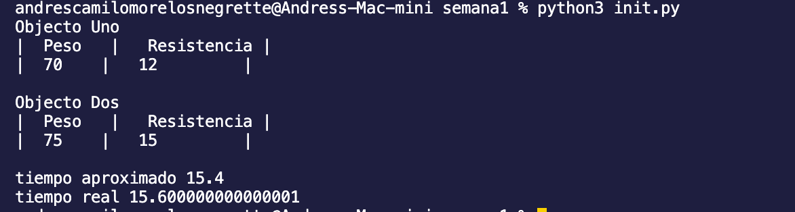
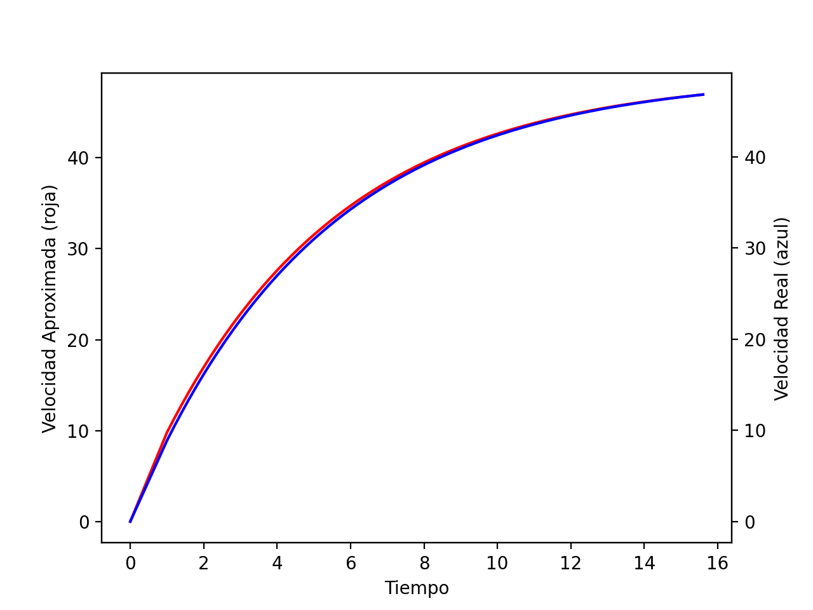

## Solución
Se evaluo la velocidad aproximada del segundo paracaidista en un intervalo de tiempo para determinar la cantidad de segundos que deberían transcurrir para que este alcance la velocidad del primer paracaidista en el segundo 10.



## Grafica


## Requirements
- Python 3
- pip3 

## External Modules
- MatPlotLib

```sh
 pip install matplotlib
```